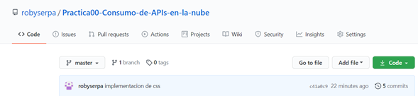

|  | **VICERRECTORADO DOCENTE** | **Código:** GUIA-PRL-001 |
| --- | --- | --- |
| CONSEJO ACADÉMICO | **Aprobación:** 2016/04/06 |
| **Formato:** Guía de Práctica de Laboratorio / Talleres / Centros de Simulación |

|  | **PRÁCTICA DE LABORATORIO** |
| --- | --- |
|
 |
| **CARRERA** : COMPUTACION | **ASIGNATURA** : PLATAFORMAS WEB |
| --- | --- |
| **NRO. PRÁCTICA** : | 1 | **TÍTULO PRÁCTICA** : Desarrollo de una aplicación web utilizando una API |
| --- | --- | --- |
| **OBJETIVO ALCANZADO:** • Conocer las arquitecturas y patrones arquitectónicos web para el diseño de aplicaciones web • Interactuar con servicios web de plataformas en la nube |
| --- |
| **ACTIVIDADES DESARROLLADAS** |
| --- |
| **1.** Identificar gráficamente la arquitectura y el patrón de diseño de la aplicación a desarrollar.Utilice una plantilla Boostrap gratuita para el desarrollo de esta práctica. |
| --- |
| **2.** Generar una llave para consumir los servicios web de la API (opcional, depende de la API seleccionada)En este caso utilicé el API: [https://rickandmortyapi.com](https://rickandmortyapi.com/) que es de uso gratuito y no depende de una llave, para acceder a la API existen varias formas, escogí la opción de búsqueda por personaje.[**https://rickandmortyapi.com/api/character/?name=**](https://rickandmortyapi.com/api/character/?name=) |
| --- |
| **3.** Crear un repositorio en GitHub con el nombre &quot;Practica00 – Consumo de APIs en la nube&quot;[**https://github.com/robyserpa/Practica00-Consumo-de-APIs-en-la-nube**](https://github.com/robyserpa/Practica00-Consumo-de-APIs-en-la-nube) |
| --- |
| **4.** Desarrollar una aplicación con HTML + CSS + Javascript + Web Services para buscar información y visualizar toda la información disponible a través de la API.  |
| --- |
| **5.** Realizar varios commits en la herramienta GitHub que demuestren el desarrollo de la aplicación.  |
| --- |
| **6.** Requisitos La aplicación Web debe permitir buscar la información a través de un nombre. Se puede ingresar un nombre de un personaje o dejar en blanco para mostrar todos los personajes.  • Además, se deberá visualizar toda la información disponible de la base de datos. Se carga la información de cada personaje detallado en una tabla.  • También, la aplicación deberá aplicar paginación en caso de la búsqueda del primer requerimiento. Es decir, si la búsqueda retorna más de 5 resultados se deberá paginar los mismos según el total de resultados obtenidos. Se realiza una búsqueda personalizada en este caso &quot;rick&quot; y me devuelve todos los resultados que coincidan con el texto ingresado. Existen varios resultados y se aplica una paginación para mostrar los resultados totales.  |
| --- |
|
 |
| --- |
| **RESULTADO(S) OBTENIDO(S)**:El consumo de la API en un entorno html. |
| --- |
| **CONCLUSIONES** :El uso de una API ayuda a crear contenidos nuevos y originales para que muchas personas consuman el producto. |
| --- |
| **RECOMENDACIONES** :Revisar el enlace de GitHub y las imágenes. |
| --- |

_ **Nombre de estudiante** _ **: Roberto Serpa**

_ **Firma de estudiante** _ **:**

**Resolución CS N° 076-04-2016-04-20**